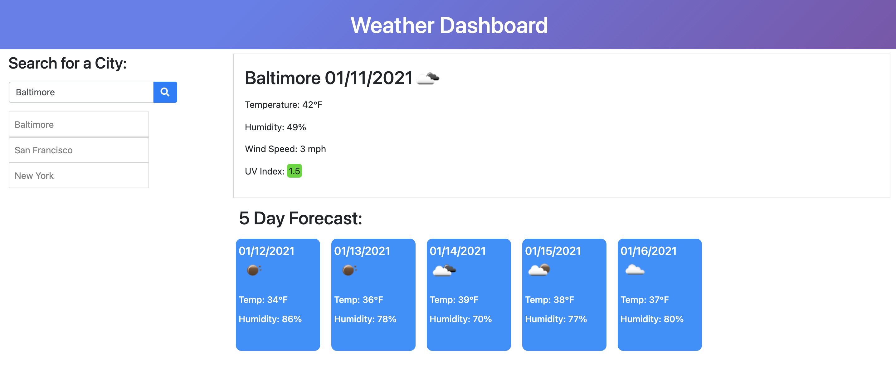

# WeatherDashboard
The Weather Dashboard app allows users to enter in any city name and retrieve the current and 5-day forecasts for that city. Every city searched will be added to a list below the input. 

## Technologies
- HTML5
- CSS
- Bootstrap v4.3.1
- Javascript
- jQuery

## Mock-Up

## Demo
- https://nvandenberge.github.io/Homework06-WeatherDashboard/
